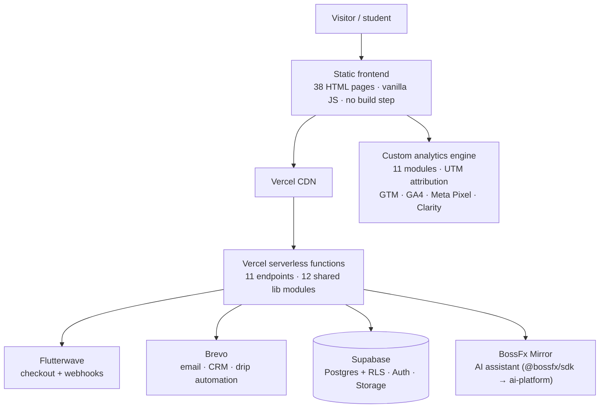

# BossFx Academy

A full-stack fintech-education platform for African traders — courses, mentorship, and automation tools — handling the complete commercial lifecycle from lead capture through payment, digital delivery, and community access. Built and operated solo.

**Live:** https://www.bossfxcademy.com · **Engineering case study:** [How BossFx was built](https://timilehin-shobande.vercel.app/case-studies/bossfx) · Part of [BossFx](https://github.com/Boss-fx), by [Timilehin Shobande](https://github.com/Gabby-tech)

---

## What this is

A production platform that takes a visitor from first click to paying customer and beyond: lead capture and nurturing, Flutterwave checkout, webhook-driven fulfillment, token-gated digital delivery, drip email automation, and post-purchase community access — plus an AI assistant, a custom analytics engine, and an admin dashboard to run it all.

It's a deliberate exercise in **doing a lot with a little**: no frontend framework, no build step, and a serverless backend that fits inside a free-tier budget.

## Architecture



- **Frontend:** 38 HTML pages, 7 CSS files, 7 JS modules — **no framework, no build step** (a choice, not a limitation: instant loads, zero build toolchain, trivial to reason about).
- **Backend:** 11 serverless functions, 12 shared lib modules.
- **Database:** 5 PostgreSQL tables, Row-Level Security on all.
- **AI:** the in-page **Mirror** assistant is powered by the separate [AI platform](https://github.com/Boss-fx/ai-platform-showcase) via `@bossfx/sdk`.

## Engineering highlights

- **Payment → fulfillment orchestration.** Flutterwave inline checkout with webhook-based fulfillment; `lib/fulfillment.js` is the single orchestrator from paid event to delivered product.
- **Token-gated downloads.** Digital products are delivered behind **HMAC-SHA256 signed tokens with time expiry** — no unguessable-URL guesswork, no perpetual links.
- **Drip automation.** Six email sequences with lead scoring and tag-based segmentation.
- **Custom analytics engine.** An 11-module client analytics layer with UTM attribution and engagement scoring — built rather than bolted on, so attribution survives across the funnel.
- **Runs on a budget.** The whole system is engineered to stay within Vercel Hobby (11/12 functions, 30s timeout), Brevo free tier, and Supabase free tier — constraints treated as design inputs.

## Tech stack

`HTML/CSS/JS (no framework)` · `Node.js` (Vercel serverless) · `Supabase` (Postgres + RLS + Auth + Storage) · `Flutterwave` · `Brevo` · `GTM / GA4 / Meta Pixel / Clarity` · `Vercel`

## Products

The platform sells a real catalog (prices are public on the live site): Forex 101 course, group and 1-on-1 mentorship, a lifetime VIP program, and the SMA Pro Trend EA as a checkout add-on.

## Project structure

```
├── api/           # Vercel serverless functions (payments, webhooks, fulfillment, …)
├── lib/           # Shared modules — products catalog, fulfillment, drip engine
├── services/      # Client-side service layer
├── admin/         # Order management, email resend, token generation, EA analytics
├── blog/          # 11 posts with JSON-LD structured data
├── resources/     # Interactive trading tools and templates
├── supabase/      # schema.sql (5 tables, RLS)
├── docs/          # Architecture, API reference, deployment, analytics, integrations
├── config.js      # Client-side configuration
└── vercel.json    # Infrastructure + security headers
```

## Getting started

```bash
git clone https://github.com/Boss-fx/bossfx-academy.git
cd bossfx-academy
npm install
```

Create `.env.local` (see [docs/environment.md](docs/environment.md) for the full reference):

```bash
FLUTTERWAVE_SECRET_KEY=     # Flutterwave API secret
BREVO_API_KEY=              # Brevo (Sendinblue) API v3 key
SUPABASE_URL=               # Supabase project URL
SUPABASE_SERVICE_ROLE_KEY=  # Supabase service role key
```

## Development

```bash
npx live-server        # static files → http://localhost:8080
vercel dev             # with serverless functions → http://localhost:3000
```

Deployment is automatic on push to `main` (Vercel). See [docs/deployment.md](docs/deployment.md) for the full guide and rollback procedures.

## Documentation

| Document | Purpose |
|---|---|
| [docs/architecture.md](docs/architecture.md) | System architecture and design decisions |
| [docs/api-reference.md](docs/api-reference.md) | API endpoint documentation |
| [docs/deployment.md](docs/deployment.md) | Deployment and rollback procedures |
| [docs/analytics.md](docs/analytics.md) | Analytics implementation guide |
| [docs/environment.md](docs/environment.md) | Environment variable reference |
| [docs/integrations/](docs/integrations/) | Per-service integration guides (Flutterwave, Supabase, Brevo, …) |
| [AUTOMATION_MAP.md](AUTOMATION_MAP.md) | Automated workflows and integrations |
| [CHANGELOG.md](CHANGELOG.md) | Version history |

## Roadmap

Near-term: error monitoring, integration tests, and a staging environment; then upsell automation, abandoned-checkout recovery, and a referral program.

## License

Proprietary — BossFx Academy. All rights reserved.

## Credits

Built by [Timilehin Shobande](https://github.com/Gabby-tech) — software engineer & founder, [BossFx](https://github.com/Boss-fx).
